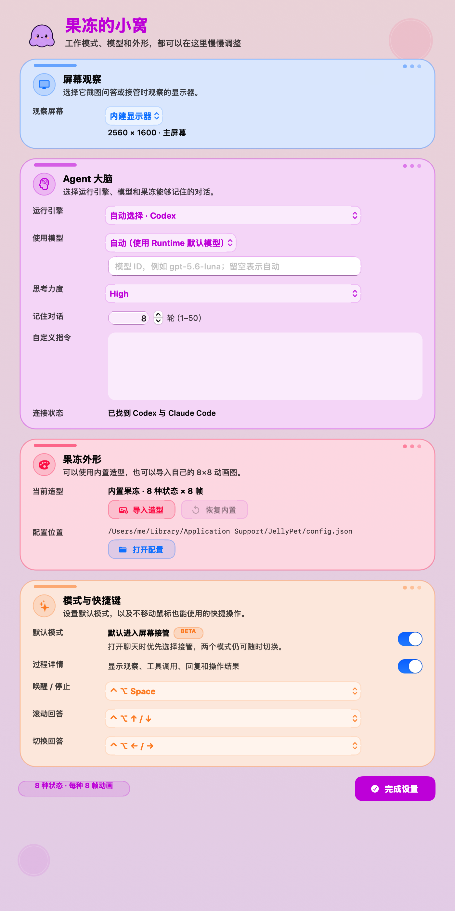
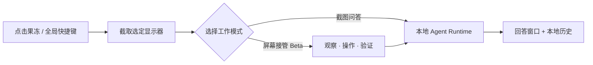
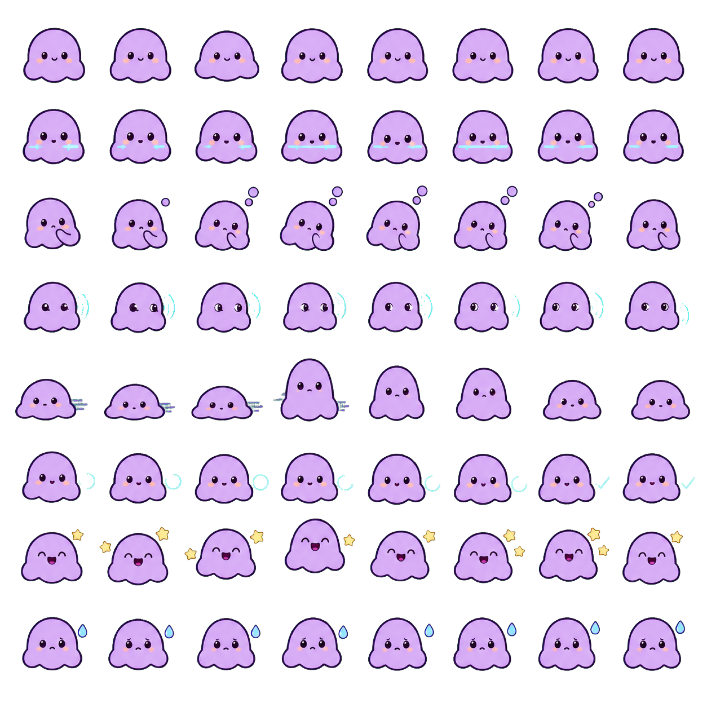

<div align="center">
  
  <h1>JellyPet · 果冻</h1>
  <p><strong>住在 macOS 桌面上的本地 AI 助手</strong></p>
  <p>看懂屏幕、连续问答、调用你已经登录的 Agent CLI，也可以在 Beta 模式下观察并操作页面。</p>

  <p>
    <a href="https://github.com/MarcWebber/ai-pet/releases/latest"></a>
    <a href="https://github.com/MarcWebber/ai-pet/releases"></a>
    <a href="https://github.com/MarcWebber/ai-pet/stargazers"></a>
    
    
    
    
    
  </p>

  <p>
    <a href="https://github.com/MarcWebber/ai-pet/releases/latest"></a>
  </p>

  <p>
    <a href="#界面预览">界面预览</a> ·
    <a href="#核心能力">核心能力</a> ·
    <a href="#快速开始">快速开始</a> ·
    <a href="#配置文件">配置</a> ·
    <a href="#从源码构建">从源码构建</a>
  </p>
</div>

> [!NOTE]
> JellyPet 不提供模型账号，也不会把 Runtime 的认证信息打包进应用。它复用本机已经安装并登录的 Agent CLI；普通截图问答只会在你主动触发时观察屏幕。

## 界面预览

<table>
  <tr>
    <td width="48%" align="center">
      <a href="./docs/images/jellypet-settings-v0.9.2.png">
        
      </a>
    </td>
    <td width="52%" valign="top">
      <h3>一个地方，调好整只果冻</h3>
      <p>当前设置页由四组粉彩卡片组成，运行引擎、模型、记忆轮数、外形和快捷键都能直接调整。</p>
      <ul>
        <li><strong>屏幕观察</strong>：选择截图问答和接管观察的显示器。</li>
        <li><strong>Agent 大脑</strong>：自动探测 Runtime，配置模型、思考强度和自定义指令。</li>
        <li><strong>果冻外形</strong>：导入一张 8×8 PNG，替换全部状态动画。</li>
        <li><strong>模式与快捷键</strong>：不移动鼠标，也能唤醒、滚动和切换历史回答。</li>
      </ul>
      <p><sub>截图来自 v0.9.2 的内置真实预览器；点击可查看原图。</sub></p>
    </td>
  </tr>
</table>

## 核心能力

| 📸 截图问答 | 🧠 连续上下文 | 🧩 本地 Runtime |
| --- | --- | --- |
| 按页面顺序回答屏幕里全部可读问题，不只处理第一题。 | 再次截图或追问时复用最近对话，可保存 1–50 轮。 | 自动探测 Codex、TraeX、Claude Code 和 OpenCode。 |
| **⌨️ 全局快捷键** | **🎨 自定义外形** | **🖱️ 屏幕接管 · Beta** |
| 鼠标不用移到窗口，也能滚动回答、切换历史和停止任务。 | 一张 8×8 透明 PNG 即可提供 8 种状态、每种 8 帧动画。 | 观察、点击、输入、滚动、拖动、导航，并在每一步后重新验证。 |

### 工作方式



## 支持的 Agent Runtime

<p>
  
  
  
  
</p>

JellyPet 至少需要一种已安装且已登录的本地 Runtime：

| Runtime | 命令 | 接入方式 |
| --- | --- | --- |
| Codex | `codex` | 常驻 app-server |
| TraeX | `traex`、`traecli` 或 `trae` | 常驻 app-server |
| Claude Code | `claude` | 非交互终端适配 |
| OpenCode | `opencode` | 非交互终端适配 |

自动选择顺序为 Codex → TraeX → Claude Code → OpenCode。JellyPet 从当前
`PATH`、`~/.local/bin`、`~/.npm-global/bin`、`/opt/homebrew/bin` 和
`/usr/local/bin` 探测命令，不再读取旧的专用路径变量或 App 内置 CLI 路径。
`cc` 不再是 Claude Code 的别名，也永远不会被当作 Agent Runtime。

## 快速开始

1. 安装并登录至少一个受支持的 Agent CLI。
2. 从 [Latest Release](https://github.com/MarcWebber/ai-pet/releases/latest) 下载最新的
   `JellyPet-<version>-macos.dmg`。
3. 打开 DMG，将 **JellyPet** 拖入“应用程序”。
4. 首次截图时，在系统设置中允许屏幕录制；Beta 接管还需要辅助功能权限。
5. 单击果冻，选择模式、输入问题并发送。

默认快捷键：

| 操作 | 快捷键 |
| --- | --- |
| 唤醒 / 停止 | `Control + Option + Space` |
| 回答向上 / 向下滚动 | `Control + Option + ↑ / ↓` |
| 上一次 / 下一次回答 | `Control + Option + ← / →` |

快捷键可在设置页修改。移动鼠标不会结束任务；再次按唤醒快捷键才会停止。

> [!WARNING]
> 当前公开包使用 ad-hoc 签名，尚未 notarize。若 macOS 阻止首次启动，请先核对 Release 页面提供的 SHA-256，再前往“系统设置 → 隐私与安全性”允许打开。

## 配置文件

首次启动会创建：

```text
~/Library/Application Support/JellyPet/config.json
```

设置页和手工编辑都使用这一份配置。重新打开设置页会重新读取文件；新配置从下一轮
请求生效。

```json
{
  "schemaVersion": 2,
  "conversation": {
    "historyTurns": 8
  },
  "assistant": {
    "runtime": "automatic",
    "model": "auto",
    "reasoningEffort": "high",
    "customInstructions": ""
  },
  "appearance": {
    "spriteSheet": null
  },
  "beta": {
    "screenTakeover": true
  }
}
```

- `historyTurns`：模型上下文与本地回答历史的保留轮数，范围 1–50。
- `runtime`：`automatic`、`codex`、`traex`、`claudeCode` 或 `openCode`。
- `model`：`auto` 或 Runtime 支持的完整模型 ID。
- `reasoningEffort`：`low`、`medium`、`high` 或 `xhigh`。
- `customInstructions`：最多 4000 个字符。
- `spriteSheet`：相对配置目录或绝对路径的 PNG；设置页导入时会自动管理。
- `screenTakeover`：启动聊天窗口时默认选择的模式，`true` 表示屏幕接管；默认 `true`。

屏幕选择、快捷键和活动详情属于本机界面偏好，仍由 macOS 偏好系统保存。

## 自定义 8×8 宠物外形

设置页选择一张透明 PNG。文件必须是正方形，宽高都能被 8 整除。整张图固定为
8 行 × 8 列：每行一种状态，每列为该状态的第 1–8 帧。

<p align="center">
  
</p>

| 行（从上到下） | 状态 |
| --- | --- |
| 1 | 空闲 `idle` |
| 2 | 观察 `observing` |
| 3 | 思考 `thinking` |
| 4 | 定位 `locating` |
| 5 | 操作 `acting` |
| 6 | 验证 `verifying` |
| 7 | 完成 `success` |
| 8 | 失败 `failure` |

导入后，JellyPet 会把文件复制到配置目录的 `PetSprites.png`，因此原文件可以移动。
“恢复默认”会删除这份副本并重新使用内置外形。

## 屏幕接管（Beta）

接管现在是默认工作模式，但模式名称始终带有 `Beta` 标记。聊天窗口会一直显示
“截图问答 / 屏幕接管 · Beta”两个 Tab；设置页的开关只决定下次打开聊天窗口时默认
选择哪一个，不会隐藏功能入口。接管可能点击、输入、按键、滚动、拖动和导航；
请只在可信任务中使用，并用唤醒快捷键停止。旧的 schema 1 配置会在首次读取时迁移到
schema 2，并把默认模式切换为接管；之后仍可在设置页关闭默认选择。

macOS 当前前台为 Chrome 或 Edge 时，Beta 接管会依次尝试 Playwright、可发现的
Chrome DevTools Protocol 端点，最后回退到 Accessibility、截图和 CGEvent。

> [!CAUTION]
> 请只在可信任务中使用屏幕接管，并保留人工检查。账号、付款、删除数据、安全桌面和系统权限仍是明确边界；随时可以用唤醒快捷键停止。

## 隐私与安全边界

- 只在用户触发截图问答或 Beta 接管时观察屏幕，空闲时不会持续截图。
- 截图存放在系统临时目录，回答后删除；启动时也会清理残留临时截图。
- 最近问题与回答以文字形式保存在本机，不保存对应截图。
- Agent 子进程继承当前用户的登录环境和认证状态；JellyPet 不复制认证令牌。
- macOS 屏幕录制、辅助功能、文件权限和安全桌面仍是最终系统边界。
- 页面内容是不可信输入；账号、付款或删除数据等操作仍需用户检查。

安全问题请参阅 [SECURITY.md](SECURITY.md)。

## 从源码构建

要求：macOS 14+、Swift 5.10 工具链，以及至少一种本地 Agent CLI。

```bash
bash scripts/build-app.sh
JELLY_SKIP_GUI_VERIFY=1 bash scripts/verify-app.sh
bash scripts/package-macos.sh
```

行为检查：

```bash
swift run --disable-sandbox JellyBehaviorChecks
```

产物：

- `dist/JellyPet.app`
- `dist/JellyPet-<version>-macos.dmg`
- `dist/JellyPet-<version>-macos.dmg.sha256`

## 代码结构

- `Sources/JellyCore/`：配置模型、回答提示、动作和会话状态。
- `Sources/JellyMac/`：配置存储、截图、Accessibility、浏览器、输入与 Runtime 适配。
- `Sources/JellyApp/`：应用生命周期、桌宠、聊天框、设置页和快捷键。
- `Tests/JellyBehaviorChecks/`：不打开桌面的核心行为检查。

## 当前限制

- 公测包尚未使用 Developer ID 签名与 notarization。
- Claude Code 和 OpenCode 的非交互参数可能随 CLI 版本变化。
- Beta 接管不属于稳定能力，浏览器扩展、远程桌面、DRM 内容、安全桌面和快速变化
  页面可能无法观察或操作。
- 构建和无窗口行为检查不能替代真实桌面、真实模型与真实页面的端到端验收。

## 项目链接

- [下载最新版本](https://github.com/MarcWebber/ai-pet/releases/latest)
- [版本变化](./CHANGELOG.md)
- [安全策略](./SECURITY.md)
- [提交问题](https://github.com/MarcWebber/ai-pet/issues)

当前仓库尚未声明开源许可证；在许可证明确前，默认保留全部权利。

<div align="center">
  <br>
  <strong>Made for macOS with Swift + AppKit.</strong>
  <br>
  <sub>如果这只果冻对你有帮助，欢迎点亮一个 ⭐</sub>
</div>
