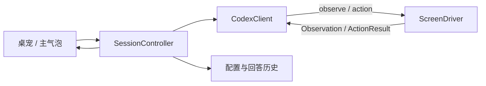
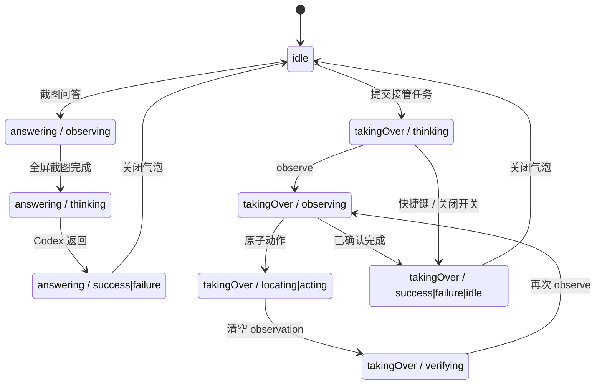

# JellyPet 核心产品契约

这份文档是下一版实现的唯一边界。重写过程中可以删除旧类、旧状态和旧测试，但不能删掉
这里确认的用户能力，也不能再为同一能力保留多套实现。

## 1. 产品只做什么

JellyPet 是一个 macOS 桌宠，只有两个工作模式。

### 1.1 截图问答

- 用户点击果冻或使用全局快捷键后，JellyPet 截取设置中选定的整块显示器。
- 截图只交给本机已登录的 Codex，JellyPet 不支持其他 Agent Runtime。
- 用户可以继续追问；最近 1–50 轮对话和本地回答历史按设置保留。
- 回答窗口支持快捷键滚动，以及查看上一条、下一条历史回答。
- 普通截图问答只在用户主动触发时运行，不在后台循环截图。

### 1.2 屏幕接管

- 用户打开主气泡中的接管开关并提交任务后，Codex 可以观察和操作当前界面。
- 原子操作只有：观察、单击、双击、键入、按键、滚动、拖动、导航和等待。
- 组合操作由 Codex 顺序调用原子操作完成，不再维护第二套组合工具实现。
- 用户提交的任务就是本轮修改授权。JellyPet 不再增加审批、只读、确认或暂停门槛。
- macOS 自己的屏幕录制和辅助功能权限仍然存在，这是系统边界，不是产品权限系统。
- 接管可通过主气泡开关或“唤醒 / 停止”全局快捷键立即退出。快捷键必须一直显示在接管界面。

## 2. 必须保留的用户体验

- 桌宠及 8 种活动动画：空闲、观察、思考、定位、操作、验证、完成、失败。
- 主气泡中的接管状态必须明显：关闭为灰色，开启为绿色，执行中为橙色。
- 粉彩设置页、Codex 连接状态、屏幕选择、模型、思考力度、会话轮数、自定义指令、
  键入速度、三组快捷键、过程详情、自定义 8×8 精灵图全部保留。
- 配置文件继续保存在 `~/Library/Application Support/JellyPet/config.json`；快捷键、
  屏幕选择、键入速度和本地回答历史继续使用 macOS 偏好存储。
- 回答历史和快捷键是正式能力，不是调试功能。
- 过程详情只展示同一会话产生的少量活动事件，不再引入独立 Ledger、Metrics 或第二套进度状态。

## 3. 不可退让的操作设计

### 3.1 只有一条执行链



- `SessionController` 是唯一产品状态源。
- `CodexClient` 是唯一模型进程和对话线程实现，只启动 `codex app-server --stdio`。
- `ScreenDriver` 是唯一屏幕实现，同时负责全屏观察、Accessibility 元素和 CGEvent 操作。
- 不保留 Runtime Factory、Responder 路由、终端适配、浏览器调试协议或失败后的备用实现。

### 3.2 截图只能显式观察

- 截图入口只有 `ScreenDriver.observe(displayID:)`。
- `type_text`、换行、点击、滚动和其他动作绝不隐式触发截图。
- 捕获固定为指定显示器的全屏静默捕获，禁止选区参数、交互截图和模拟截图快捷键。
- 一次观察最多产生一张内存截图；交给 app-server 时只创建本轮临时文件，轮次结束立即删除，启动时清理异常残留。
- 每个改变界面的动作都会让旧观察失效；Codex 下一步必须重新调用 `observe`。

### 3.3 键入只有一套实现

`type_text(locator, finalText)` 接收目标输入框和完整目标文本，但绝不直接替换完整值。

1. 使用最新 locator 找到唯一可读写的语义输入目标。
2. 点击并确认焦点仍在同一个进程、同一个编辑器或其补全弹层。
3. 重新读取编辑器当前值，不使用旧缓存判断“已经完成”。
4. 计算当前值与目标值的最长公共前缀和后缀，只选择并删除真正不同的区间。
5. 使用 CGEvent 逐字符输入剩余文本；禁止剪贴板、Accessibility 整段赋值和一次性粘贴。
6. 输入速度由设置控制；空格、标点、花括号和换行有不同停顿。
7. 较长文本可以偶尔输入一个相邻键、停顿、退格并改正；不能让模拟错字改变最终内容。
8. 输入后重新读取实际值。若内容不完整、被手工删改或输入中断，下次调用重新计算差异并继续，
   不能因为上一次曾经成功就拒绝修复。

已有 starter code 不是只读数据，也不能默认整段清空。正常情况只改差异区；当已有内容确实损坏时，
允许删除并重输必要范围。编程任务由 Codex 决定是否加入少量关键注释，不逐行解释。

### 3.4 完成不是一个缓存布尔值

- 动作执行后直接把当前 `observation` 设为 `nil`，旧观察立即作废；不再额外保存
  `observationIsDirty`，也不计算或比较 `Fingerprint`。
- Codex 返回完成文本时，如果最后一步不是成功观察，`SessionController` 不接受完成，先要求重新观察。
- 用户手工修改后再次唤醒或再次调用 `observe`，得到的就是新的真实观察；是否继续修复由 Codex 根据
  当前内容决定，不依赖上一轮“已经完成”的缓存。
- 会话真正结束后不会在后台监控屏幕；用户再次唤醒时开启新一轮。

### 3.5 组合操作不增加执行路径

- Codex 通过 `observe → click/type_text → observe` 组合原子操作。
- 产品层不再提供 `activate_and_verify`，不保存副作用记录，也不做幂等或权限拦截。
- 每个动作只经过 `SessionController → ScreenDriver` 这一条路径。

## 4. 唯一状态机



`SessionMode` 只区分空闲、问答和接管；`PetActivity` 表示这一刻在观察、思考、定位、操作、
验证、完成还是失败。UI 动画只读取这一份 Activity。回答历史位置只是气泡导航状态，不参与
会话完成判断。

## 5. 核心数据结构

重写后核心只保留下列结构；同一事实只能存在一份。

```swift
enum SessionMode {
    case idle, answering, takingOver
}

enum PetActivity {
    case idle, observing, thinking, locating, acting, verifying, success, failure
}

struct SessionSnapshot {
    var mode: SessionMode
    var activity: PetActivity
    var message: String?
    var events: [ActivityEvent]
    var request: TakeoverRequest?
}

struct TakeoverRequest {
    let displayID: UInt32
    let task: String?
    let assistantPreferences: AssistantPreferences
}

struct ScreenObservation {
    let semantics: ScreenSemantics?
    let screenshotPNG: Data
}

struct ScreenSemantics {
    let applicationName: String
    let windowTitle: String
    let pageURL: String?
    let elements: [ScreenElement]
}

struct ScreenElement {
    let id: String
    let parentID: String?
    let role: ElementRole
    let label: String
    let value: String?
    let frame: NormalizedRect
    let isEnabled: Bool
}

struct ElementLocator: Decodable {
    let application: TextMatcher?
    let window: TextMatcher?
    let pageURL: TextMatcher?
    let role: ElementRole?
    let label: TextMatcher?
    let value: TextMatcher?
    let ancestorRole: ElementRole?
    let ancestorLabel: TextMatcher?
    let ancestorValue: TextMatcher?
    let ordinal: Int?
}

enum ScreenAction: Decodable {
    case click(ElementTarget)
    case doubleClick(ElementTarget)
    case typeText(target: ElementTarget, text: String)
    case keyPress(key: ScreenKey, modifiers: [KeyModifier])
    case scroll(target: ElementTarget?, deltaX: Int, deltaY: Int)
    case drag(fromX: Int, fromY: Int, toX: Int, toY: Int, durationMilliseconds: Int)
    case navigate(url: String)
    case wait(milliseconds: Int)
}

struct ActivityEvent {
    let activity: PetActivity
    let message: String
    let sequence: Int?
    let details: String?
}

enum TextEditPlan {
    case unchanged
    case replace(location: Int, length: Int, text: String)
}
```

`SessionController` 私有地保存当前任务 ID、回答偏好、最近一次 `ScreenObservation` 和动作序号；
这些事实没有第二份公开模型。`CodexClient` 内部只保存一个 app-server 进程、当前 thread/turn ID
和有限最近对话；每轮只创建一个当前 Codex thread。

`ActivityEvent` 只支持主气泡里的“过程详情”：普通模式显示最近几条摘要，详情模式按观察、动作、结果
展示步骤和补充文字。它不驱动状态机、不持久化，也不作为完成条件；若将来删除过程详情，整个结构可以
一起删除。

## 6. 文件和职责边界

重写目标不是把大文件机械拆小，而是删除重复职责。

- `JellyCore/SessionController.swift`：唯一状态机、截图问答、接管工具路由、取消与恢复。
- `JellyCore/ScreenModel.swift`：Observation、Locator、Action 和验证规则。
- `JellyCore/TextEditing.swift`：最小差异和人类输入节奏，纯函数、可直接测试。
- `JellyMac/CodexClient.swift`：Codex app-server 生命周期、线程和动态工具协议。
- `JellyMac/ScreenDriver.swift`：唯一屏幕入口；同目录的 Accessibility 与 CGEvent 文件只是它的
  内部观察器和执行器，不是备用驱动。
- `JellyApp/AppCoordinator.swift`：只连接 UI、设置和 `SessionController`，不实现第二套状态机。
- 现有设置页、气泡、桌宠、配置存储可以保留视觉结果，但状态全部来自上述单一会话快照。

生产 Swift 总量目标为 **3,000–5,000 行**。设置页、主气泡、桌宠、配置和快捷键都是目标的一部分，
不能拆开口径，也不能通过压缩排版或删除体验凑数字。

## 7. 重写时必须删除的旧内容

- 旧实现中并列存在的回答状态、接管状态、流式状态、事件和指标副本。
- `AppCoordinator` 中与核心会话重复的活动状态和完成判断。
- Runtime/Responder/Factory/Fallback 类和任何非 Codex 分支。
- 动作后自动截图、截图兜底、选区截图或模拟截图快捷键。
- 剪贴板输入、Accessibility 整段赋值、Command+A 全量覆盖和多套输入策略。
- Workflow、Ledger、独立 ProgressMonitor、预算状态机和未被 UI/核心调用的数据结构。
- 只验证实现细节复述、却不能证明用户结果的测试。

## 8. 验收标准

### 静态和行为

- 全仓没有非 Codex Runtime、第二套屏幕驱动或第二套输入实现。
- 全屏捕获命令/API 不含交互选区参数；换行和键入路径不调用截图。
- 配置、历史、三组快捷键、键入速度、过程详情和自定义外形都有行为检查。
- 最小文本差异覆盖：保留 starter code、修复中间损坏、输入中断、手工删改、Unicode 和换行。
- 组合操作覆盖：动作后旧观察清空，下一步必须显式重新观察真实结果。

### 构建和视觉

- Debug/Release 构建、行为检查、包资源检查和签名检查通过。
- 设置页四张粉彩卡片完整可编辑。
- 接管按钮的关闭、开启、执行中颜色和快速退出提示通过布局检查。

### 真实端到端

- 在用户指定的 LeetCode 页面启动接管，不触发选区截图。
- 保留编辑器已有签名和非目标代码，只逐字写入必要差异。
- 输入速度可见受设置影响，长代码有自然停顿和少量可恢复错字。
- 手工删改尚未完成的答案后，接管重新读取当前值并继续修复。
- 运行后读取真实编译/测试结果；只有出现明确成功后才报告完成。
- 测试期间不关闭或替换用户自己正在运行的 JellyPet 实例，除非用户明确允许。
