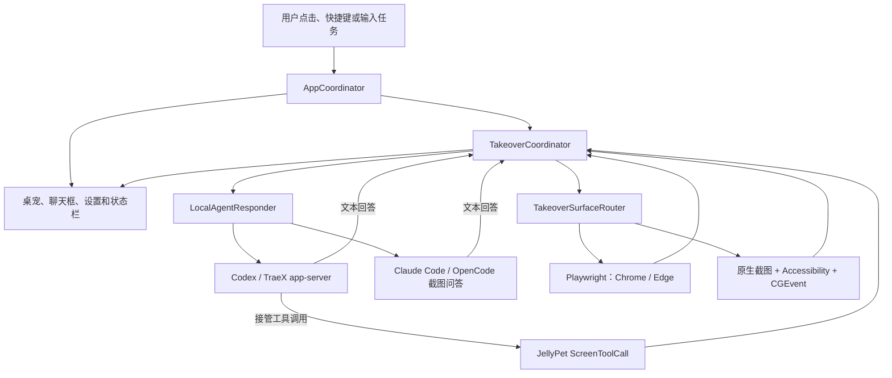

# JellyPet 项目交接

本文记录 2026-08-26 的当前开发基线，面向下一位维护者。接管重构从
`main@52fc081` 开始演进；当前 HEAD 仍是未发布开发版，不等同于已经发布的 `0.9.2`。

## 先看结论

JellyPet 已经具备两条可运行链路：

- 截图问答：截取用户选择的显示器，把图片和问题交给本机 Agent Runtime，再流式展示
  回答。
- 屏幕接管：AI 负责理解目标和选择工具，JellyPet 负责观察界面、执行受限动作并返回
  最新结果。

当前源码的行为检查、Release 构建、包资源检查、设置页布局和主气泡布局检查均已通过。
未接入的工作流、文件 Ledger 和终端 Runtime 的第二套接管循环已经删除；
屏幕接管现在只有
`TakeoverCoordinator` → Codex/TraeX app-server → JellyPet 屏幕工具这一条执行路径。

当前开发版仍不适合作为新的发布版本，原因不是还有一套待接入架构，而是缺少真实能力
证据：TraeX 的内置工具边界尚未实测，真实模型、真实浏览器附着和真实桌面接管尚未验收，
`activate_and_verify` 也只提供进程内防重，不能承诺跨重启 exactly-once。

## 当前基线

| 项目 | 当前值 |
| --- | --- |
| 分支与重构起点 | `main`，接管重构起于 `52fc081` |
| 应用版本 | `0.9.2`，build `15` |
| 平台 | macOS 14+，Apple Silicon |
| 工作树 | 本轮整理后无未提交改动；接手时仍以实时 `git status` 为准 |
| 构建产物 | `dist/JellyPet.app`，本地 ad-hoc 签名 |
| 发布状态 | 当前提交尚未形成新版本，也未做 notarization |

接手时先运行 `git status --short --branch` 和 `git diff --stat`。若后续出现未提交改动，
应先确认归属，不能用 `git reset --hard` 或整目录覆盖来“恢复干净”。

## 产品与能力边界

### 截图问答

`TakeoverCoordinator.answer` 负责截图、临时文件清理和回答流。此模式不会注册 JellyPet
屏幕工具；最近对话只由当前 Agent Runtime 会话维护，Coordinator 不再复制第二份上下文。

### 屏幕接管

接管不是把自然语言解析成固定脚本。Codex/TraeX app-server 中的 AI 读取 Skill 和最新
观察，自主决定下一次工具调用；Claude Code/OpenCode 只保留截图问答，不参与接管。
App 向接管 Agent 只提供以下能力：

- 观察当前语义树和截图；
- 点击、双击、拖动、输入、按键、滚动、等待和 HTTP(S) 导航；
- 文本由原生与 Playwright 两条路径按同一预设逐键输入，不使用整段赋值、`fill` 或剪贴板；
- 用稳定语义 locator 在每次新观察中重新定位元素；
- 原子输入和滚动后由 AI 重新观察；外部副作用统一用 `activate_and_verify` 单次激活并
  检查后置条件；
- 在动作过多、观察过多、连续无变化或连续不可观察时停止会话。

它没有通用待办工具，也不自带网页搜索 API。Codex 接管线程显式关闭了 Shell、Apps、
Goals、多 Agent、插件和 MCP，只注册 `jellypet` 屏幕工具；因此“浏览器能力”来自操作
用户当前浏览器，不是另一套联网搜索工具。

这一边界目前不能无条件推广到所有 Runtime，详见下表。

| Runtime | 接入 | 截图问答 | 屏幕接管 | 当前工具约束 |
| --- | --- | --- | --- | --- |
| Codex | 常驻 app-server | 支持 | 加载 `jellypet-takeover/SKILL.md` | 关闭 Shell、Apps、Goals、多 Agent、插件和 MCP；注册 JellyPet 动态工具 |
| TraeX | 常驻 app-server | 支持 | 加载同一份 Skill | 清空 MCP，但未像 Codex 一样显式关闭其余内置工具，需实测和收紧 |
| Claude Code | 每轮终端调用 | 支持 | 不支持，返回明确错误 | CLI 只开放 `Read` |
| OpenCode | 每轮终端调用 | 支持 | 不支持，返回明确错误 | 截图问答调用尚未显式限制 CLI 自带工具，需实测 |

app-server 线程当前填写了 `sandbox: danger-full-access`。Codex 路径虽然同时关闭了 Shell，
但这个字段本身不是操作系统沙箱保证；TraeX 和 OpenCode 截图问答的真实可用工具仍需
逐个验证。

外部副作用的既定产品契约是：用户交付的任务目标就是本次执行授权，不在发送、提交、
购买或删除前另加审批、确认或暂停。为减少重复副作用，这些动作不能走普通点击，必须用
带后置条件的 `activate_and_verify` 执行一次；结果无法确认时应停止并说明“待对账”，
不能为了获得反馈再次激活。这仍不是跨进程事务保证，用户只应在确实希望执行整个任务时
开启接管。

## 运行时架构



关键原则是：AI 决策只有一条入口，真实动作也只有一条入口。`TakeoverCoordinator`
接收工具调用、刷新观察、解析 locator、执行动作、验证结果并发布事件。元素 ID 只属于
当前观察，任何界面变化后都应重新解析 locator。

浏览器路由会在 Chrome/Edge 前台时尝试附着 Playwright。当前实现先读取已发现的
Extension/CDP 会话，连接失败就回到原生 Accessibility、截图和 CGEvent；它不会伪造
测试网页。

## 模块职责

| 目录或文件 | 责任 |
| --- | --- |
| [`JellyPetMain.swift`](../Sources/JellyApp/JellyPetMain.swift) | 进程入口，以及资源、设置页和主气泡的无交互验证入口 |
| [`AppCoordinator.swift`](../Sources/JellyApp/AppCoordinator.swift) | 应用级装配和唯一 UI 流程协调者 |
| [`BubblePanelController.swift`](../Sources/JellyApp/BubblePanelController.swift) | 问答、接管开关、过程事件和回答展示 |
| [`TakeoverCoordinator.swift`](../Sources/JellyCore/TakeoverCoordinator.swift) | 问答与接管会话、工具分发、动作验证和状态发布 |
| [`ElementLocator.swift`](../Sources/JellyCore/ElementLocator.swift) | 稳定语义 locator 及其重新解析规则 |
| [`TakeoverProgressMonitor.swift`](../Sources/JellyCore/TakeoverProgressMonitor.swift) | 会话内的无进展检测和硬停止预算 |
| [`Ports.swift`](../Sources/JellyCore/Ports.swift) | AI、截图、语义观察和动作执行之间的协议边界 |
| [`LocalAgentResponder.swift`](../Sources/JellyMac/LocalAgentResponder.swift) | Runtime 选择，不拥有产品策略 |
| [`CodexAppServerClient.swift`](../Sources/JellyMac/CodexAppServerClient.swift) | app-server 生命周期、Skill 发现和动态屏幕工具 |
| [`TerminalAgentResponder.swift`](../Sources/JellyMac/TerminalAgentResponder.swift) | Claude/OpenCode 非交互截图问答；显式拒绝屏幕接管 |
| [`PlaywrightBrowserSurface.swift`](../Sources/JellyMac/PlaywrightBrowserSurface.swift) | Playwright 附着、浏览器语义和浏览器动作 |
| [`BrowserAccessibilityContextProvider.swift`](../Sources/JellyMac/BrowserAccessibilityContextProvider.swift) | 原生 Accessibility 语义树 |
| [`CGEventScreenActionExecutor.swift`](../Sources/JellyMac/CGEventScreenActionExecutor.swift) | 原生鼠标和键盘动作 |
| [`jellypet-takeover/SKILL.md`](../Sources/JellyApp/Resources/Skills/jellypet-takeover/SKILL.md) | app-server 接管 Agent 的中文操作契约 |
| [`Tests/JellyBehaviorChecks/`](../Tests/JellyBehaviorChecks/) | 无真实桌面、无真实模型的行为检查 |
| [`scripts/`](../scripts/) | 构建、资源验证和 macOS 打包 |

## 推荐阅读顺序

不要从每一个 View 或数据结构开始逐行读。按一条真实请求穿过系统更容易建立整体模型：

1. `JellyPetMain.swift`、`AppDelegate.swift`、`AppCoordinator.swift`：应用如何启动、装配
   依赖并进入问答或接管。
2. `Ports.swift`、`Models.swift`、`TakeoverModels.swift`：先认识跨模块传递的数据。
3. `TakeoverCoordinator.swift`：顺着 `start` → `handle` → `observe/perform` 阅读主循环。
4. `LocalAgentResponder.swift`：看 Runtime 分流；再分别读 `CodexProcessResponder.swift`、
   `CodexAppServerClient.swift` 和 `TerminalAgentResponder.swift`。
5. `SemanticContext.swift`、`ElementLocator.swift`：理解快照、父子层级和稳定定位。
6. `PlaywrightBrowserSurface.swift`、`BrowserAccessibilityContextProvider.swift`、
   `CGEventScreenActionExecutor.swift`：理解观察和动作最终落在哪里。
7. `BubblePanelController.swift` 和 `AppCoordinator.handleSession`：最后看过程如何反馈给用户。
8. 对照 `Tests/JellyBehaviorChecks/` 阅读外部行为断言，不把测试桩当成真实 E2E。

## 单一事实源

- 产品配置：`~/Library/Application Support/JellyPet/config.json`，由
  `JellyConfigurationStore` 和 `AppPreferencesStore` 读写。
- 纯界面偏好：macOS 偏好系统中的显示器、快捷键、活动详情和回答历史。
- 接管会话状态：`TakeoverCoordinator.Session`，只在当前 App 进程和当前任务内有效。
- 模型对话上下文：当前 `AIResponder` 会话；`TakeoverCoordinator` 只记录是否允许追问，
  不再拼接一份重复历史。
- app-server 接管规则：打包后的 `jellypet-takeover/SKILL.md`，由 AI Runtime 自己发现并
  在首轮加载。

清理后，屏幕接管没有终端提示词副本、第二套轮次预算或未接入的 Workflow/Ledger。
进展停止阈值只定义在 `TakeoverProgressMonitor`，接管操作契约只定义在打包 Skill。

仍需注意：`activate_and_verify` 的不确定激活记录只保存在
`TakeoverCoordinator.Session.uncertainActivationSignatures`。它只能阻止当前会话在未变化
界面上立即重试，不能提供跨 App 重启的 exactly-once 保证。

## 当前接管重构概览

- 主聊天框从两个模式 Tab 改为一个持久化的 `BETA` 接管开关，设置页删除重复开关。
- 原 `human-exam-taking` Skill 被中文 `jellypet-takeover` Skill 替代。
- Accessibility 和 Playwright 快照增加父子层级与结构角色。
- 新增稳定 locator 和单次激活验证；删除重复包装输入、滚动与观察循环的动作组。
- 新增语义加 16×16 视觉指纹的进展监管，固定上限是 60 次动作、90 次观察、动作后
  连续 6 次无变化、连续 12 次相同观察或连续 3 次不可观察。
- 行为检查覆盖 locator、层级、单次激活和进展监管的外部行为。
- 新增设置页和主气泡布局验证入口。
- 删除没有生产调用者的 Workflow/Ledger、终端第二套接管循环、重复的模型对话历史、
  损坏截图的原始字节指纹兜底、一次性主气泡渲染入口和仅测试内部实现的断言。
- locator 取消 Scope/Ancestor 包装模型，原生 Accessibility handle 直接归观察 Provider
  所有；URL 校验回到 `ScreenAction`，不再各设一个 Policy 或 Registry。

这些上限是硬编码策略，尚未通过真实动态页面校准。不要为了“可配置”再增加配置项；先
用实际失败样本证明哪些阈值需要变化。

## 已完成的验证

本次交接前实际执行了以下检查：

| 层级 | 命令或结果 | 结论 |
| --- | --- | --- |
| Swift 行为检查 | `swift run --disable-sandbox JellyBehaviorChecks` | 通过；使用伪 Runtime 和内存/临时文件桩，不是模型或桌面 E2E |
| Release 构建 | `bash scripts/build-app.sh` | 通过；生成并 ad-hoc 签名 `dist/JellyPet.app` |
| 包资源检查 | `JELLY_SKIP_GUI_VERIFY=1 bash scripts/verify-app.sh` | 通过；验证资源、配置、Skill、声音、Plist 和签名 |
| 设置页布局 | `dist/JellyPet.app/Contents/MacOS/JellyPet --verify-settings-layout` | 通过；卡片、按钮、输入框和文本区尺寸检查成功 |
| 主气泡布局 | `dist/JellyPet.app/Contents/MacOS/JellyPet --verify-main-bubble-layout` | 通过；接管开关、Beta 标记和标签均在容器内 |

没有在本次交接中验证：

- 真实 Codex/TraeX/Claude/OpenCode 模型往返；
- 真实 Chrome/Edge 的 Playwright Extension 或 CDP 附着；
- 在牛客等真实页面完成一道题的桌面 E2E；
- 发送、提交、购买、删除等外部副作用的失败和恢复路径；
- DMG 安装、Developer ID 签名和 notarization。

构建通过、监听成功、模型回复、浏览器动作和完整桌面 E2E 是不同证据，交接后仍应分别
记录。

## 还要做什么

### P0：发布前必须完成

1. 实测并收紧 Runtime 工具边界。确认 TraeX 接管线程除了 JellyPet 动态工具外没有可用
   Shell/文件工具；确认 OpenCode 截图问答不会执行屏幕问题之外的本机操作。无法证明时，
   应把对应能力从 UI 中禁用，而不是只依赖提示词。
2. 分 Runtime 做一次真实模型连通性检查，再用真实浏览器完成至少一条只读任务和一条
   可逆写入任务。保留观察、工具调用、执行结果和用户可见状态四层证据。
3. 对 `activate_and_verify` 做真实失败验收：验证结果不明确时不重复触发，重启后明确
   告知用户无法提供 exactly-once 保证。
4. 在上述行为冻结后更新版本与最终 Changelog；不要把当前仍标记为 `0.9.2` 的开发包
   直接当作新版本发布。

### P1：随后完成

1. 把 `--verify-settings-layout` 和 `--verify-main-bubble-layout` 接入标准验证脚本；在无
   WindowServer 的环境明确跳过，在真实桌面环境必须执行。
2. 用真实动态页面校准进展监管阈值和视觉指纹，重点观察加载动画、光标、计时器和长题目
   页面，避免误判“无进展”。
3. 增加真实 Playwright 附着失败时的用户可见诊断，明确当前使用 Playwright 还是原生
   Accessibility 回退。
4. 冻结后制作 DMG，校验 SHA-256，并在一台未参与开发的 macOS 上走首次授权和安装流程。

### 暂时不要做

- 不要新增 manager、facade、adapter 或可配置阈值来包住尚未证明的需求。
- 不要为测试搭建伪造网页并把它当成浏览器 E2E。
- 不要在没有真实调用者前重新加入 Workflow、Ledger、Manager 或恢复抽象。
- 不要用公开模型回答成功代替 Playwright、Accessibility 或 CGEvent 的真实验收。

## 常用验证命令

```bash
git status --short --branch
git diff --check

swift run --disable-sandbox JellyBehaviorChecks
bash scripts/build-app.sh
JELLY_SKIP_GUI_VERIFY=1 bash scripts/verify-app.sh

dist/JellyPet.app/Contents/MacOS/JellyPet --verify-settings-layout
dist/JellyPet.app/Contents/MacOS/JellyPet --verify-main-bubble-layout
```

真实模型 smoke 会产生一次外部模型请求，只在明确允许时运行：

```bash
JELLY_REAL_AGENT_SMOKE=codex \
  swift run --disable-sandbox JellyBehaviorChecks
```

完成交接时，应把每项结论标成“静态检查、构建、包验证、模型、浏览器或桌面 E2E”中的
一种，避免用较弱证据覆盖较强声明。
